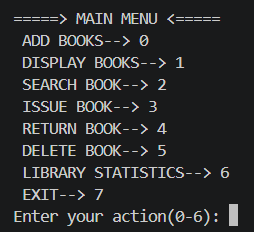
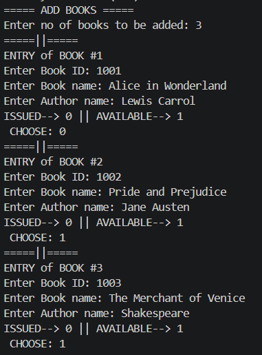
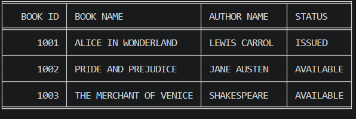
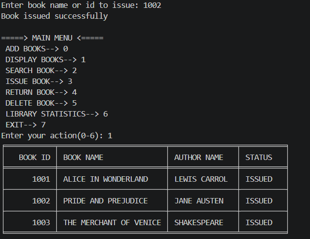
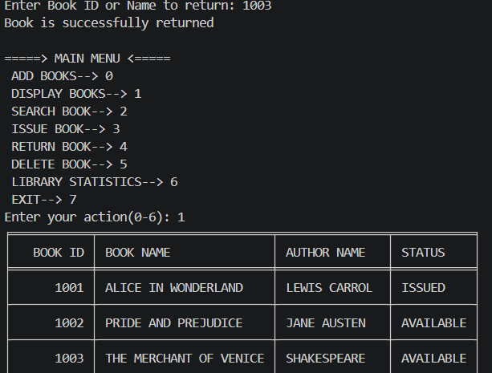
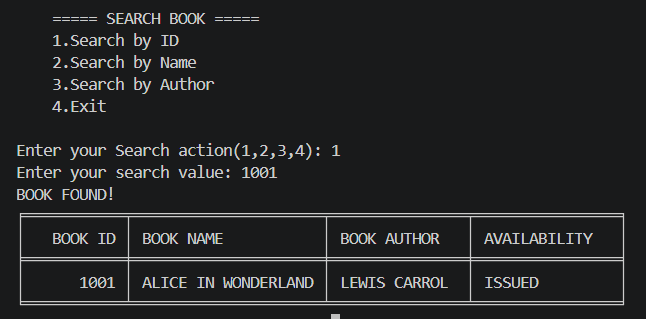
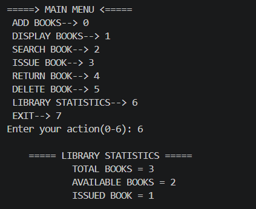

# Library Management System

## Overview
- The Lirary management system is a simple **menu-driven Python program** designed 
to manage books in library.
- The system allows user to *add multiple books*, *display the available book record*,
*search for book*, *issue and return book* and *view basic library statistics*.
- The project uses Python lists, functions, loops, conditional statements,
input validation, and the **tabulate** library.
- Data is stored temporarily in the program.Once program ends or restarts data is
also cleared

## Features
1. **Add Books-** 
- Allow user to add multiple books at once.
- Take Book ID,Book Name,Author name and Availability as input
- Validates Book ID and Availability input
2. **Display Books-**
- Display the added books in library.
- Uses *tabulate* to display clean and tabular data.
3. **Search Books-**
- Books can be searched using Book ID,Book Name and Author name
- Displays the details of the searched book
4. **Issue book-**
- Allow user to search book using Book ID or Book Name
- Change status of an available book to **ISSUED**
- Prevents already issued book to be issued again.
5. **Return Book-**
- allow user to return book using input Book ID or Book Name
- Change status of an issued book to **AVAILABLE**
6. **Delete Book-**
- Allow user to remove the book from the library collection 
7. **Library Statistics**
- Display Total Books,No of Available Books and No of Issued Books
8. **Menu-Driven Interference**
- User can select the required action from main menu and coninue using program
  will continue until user select *exit* option

## Technologies used
- **Programming language used-** Python
- **Python libraries-** Tabulate
- **Integrated Development Environment (IDE)-** Visual Studio Code
- **Execution-** Python terminal/Command Prompt

## Steps to install and run the project
1. **Install python** on your computer and check on cmd using *python --version* 
2. **Clone the GitHub** repository to your computer and open project in *VS Code*
3. **Tabulate library** Open VS code and run in terminal *pip install tabulate*
4. **To run project** 
     -open terminal/command prompt and run:  **python main.py**
      Main menu will appear in terminal.

## Testing Instructions

1. Run the program using the terminal.
2. Add a few books and check the book details.
3. Display the books and verify the table.
4. Search for a book using ID, name, or author.
5. Issue and return a book and check its status.
6. Delete a book and verify that it is removed.
7. Check the library statistics.
8. Test some invalid inputs to check the validation.

## Screenshots

### Main Menu

 ### Add Books

### Display Books

### Issue Book

### Return Book

### Search Book

### Library Statistics

